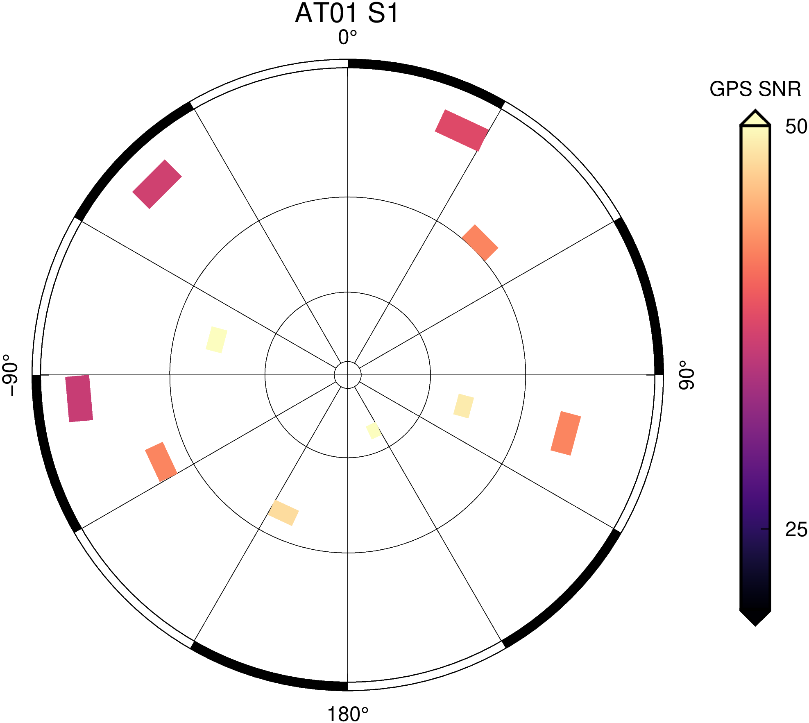
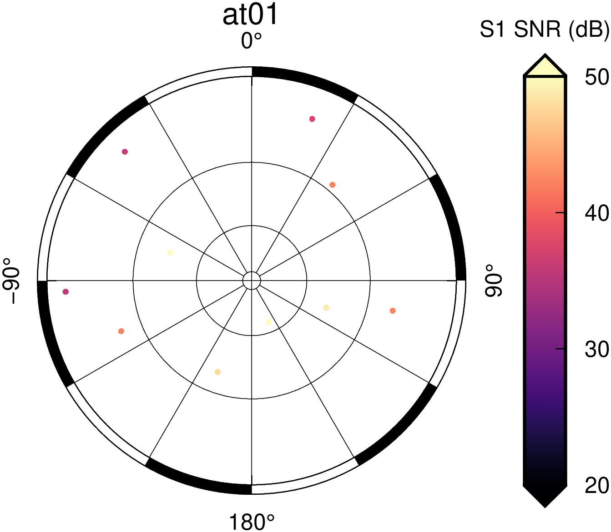

gnss-snr-skyplot
-------

Installation requirements: gfortran, GMT v5 or later, GAMIT/GLOBK v10 or later.

This set of scripts makes use of Kristine Larson's SNR extractor (https://github.com/kristinemlarson/gnssSNR), plus GMT and a few GAMIT/GLOBK utilities to create some simple sky plots of the SNR at each site. Currently, the plots can show SNR for the L1 or L2 frequencies (GPS observables S1 and S2), both with and without an azimuthal average subtracted. Timeseries plots are possible but may require some experimentation.

-- Installation and basic use --
To install the gnssSNR utility, go to the gnssSNR subdirectory and type 'make'. You must have gfortran for this to work.

You are responsible for installing GMT and GAMIT/GLOBK on your own also.

The RINEX files must be version 2, not 3 - there is a RINEX 3-compatible version of the gnssSNR script but I haven't incorporated it here. Let me know if you desperately need this and I will consider it - or better yet, submit a pull request that incorporates it. The script will determine the RINEX data's day from the filename format, auto-download igs orbits using the GAMIT command sh_get_orbits, and then run gnssSNR.e to extract the SNR values. After this, some GMT plotting and averaging commands will be used to make the figures.

If you want a better estimate of the noise at a particular site, use more data - the script will combine all available data to estimate the SNR at a particular azimuth/elevation.

The choice of S1/S2 observable, binning size for azimuth and elevation are hard-coded in the file params.config. Feel free to change them as you like.

-- Testing and examples -- 
From the main directory, run ./test_snr_plots.sh. This runs './make_skymaps.sh <site>' where site=at01, so it will create a basic sky plot from the snippet of test data included with the gnssSNR utility.
.
This looks pretty sparse because the test data is so short. Use a full day of data, or better yet, up to a month of data to get a good average.

If you don't like the gridding, you can create an ungridded plot to see the SNR values along each individual satellite track. Use ./skymap_single_ungridded.sh for this.

Finally, to create timeseries, it is a two-step process: first run ./grid_for_timeseries.sh <rinex files>, then run ./make_timeseries_plots.sh to make the plots. Note that working on several years of data may take a LONG time - possibly hours to days, and will create a large number of plain-text files. Use at your own risk! This code has not been optimized.

Happy observing! Feel free to contact me with any bugs, issues, or suggestions.

